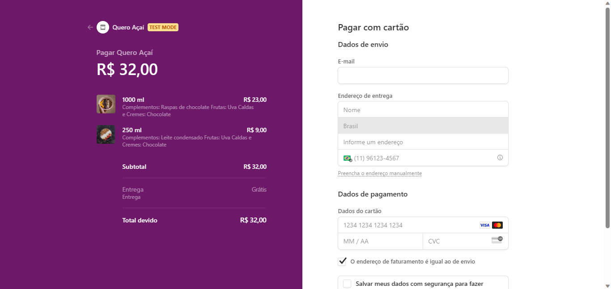
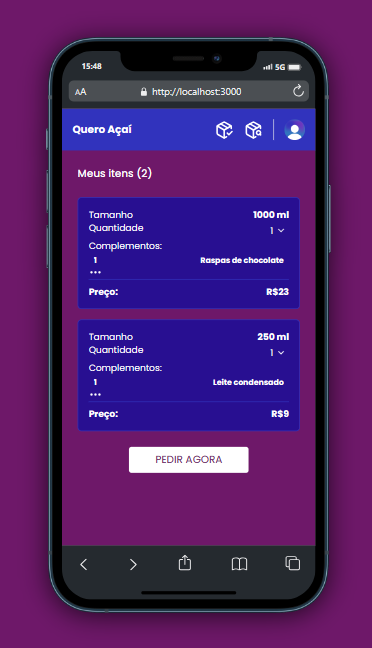

# Quero Açaí
Aplicação Full-Stack. Crie sua conta e escolha entre as inúmeras opções de complementos e diferentes tamanhos para o seu açaí. Pague online e rápido.

A autenticação fica totalmente a cargo do Clerk. Os itens como complementos, tamanhos e preços foram implentados utilizando o Stripe, assim como o checkout (pagamento). O carrinho utiliza de um banco postgres feito com prisma para armazena todas as informações necessárias como tamanho, quantidade e complementos.






## ✨ Tecnologias
- Next.js | TypeScript | TailwindCSS | Prisma | Clerk | Stripe | Zod | Radix UI

## 💻 Uso
Para testar o método de pagamento atrvés do deploy, insira o número:
4242 4242 4242 4242 como cartão de crédito fictício

Para testar localmente, crie sua aplicação através do Github e preencha as variáveis ambientes em um arquivo chamado .env.
Depois, em seu terminal:

```bash
# Clone o repositório
git clone https://github.com/ViGF/quero_acai.git
# Acesse a pasta back-end do projeto
cd trips
# Instale as dependências
pnpm i
# Execute a aplicação
pnpm dev
```